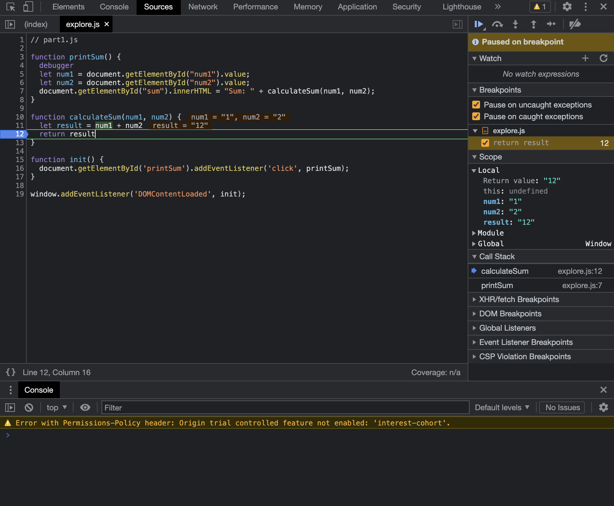
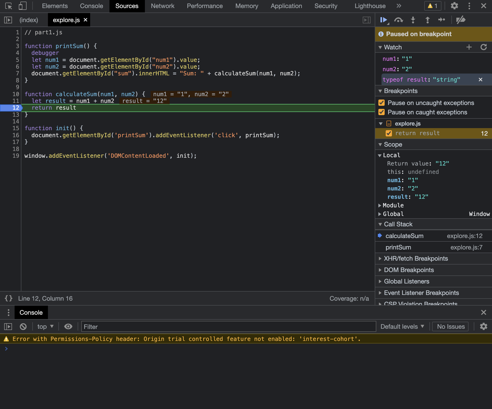
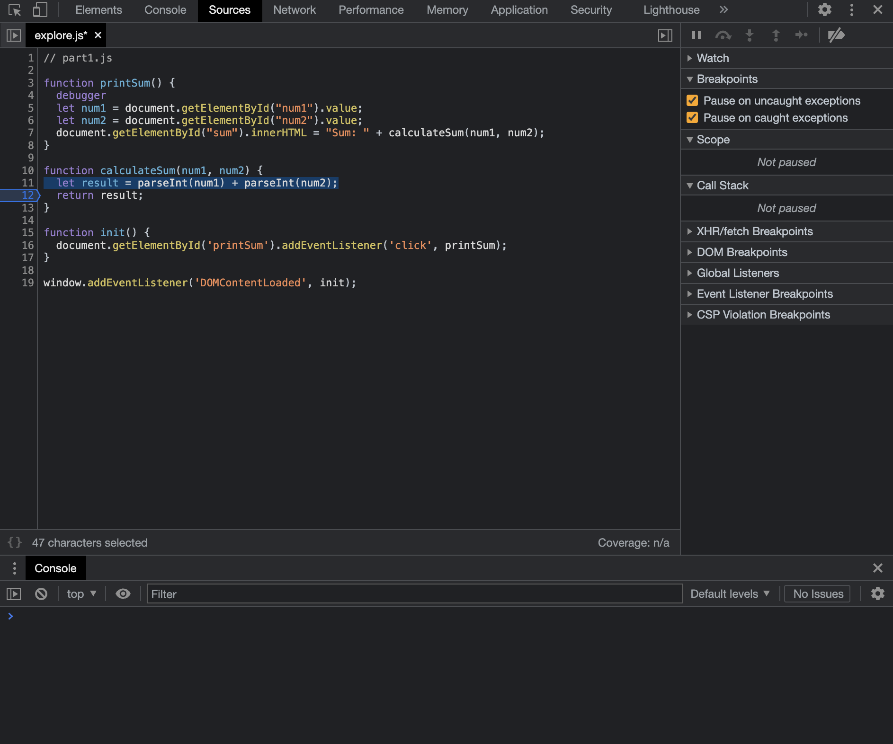

1. The bug is that the `+` operator is used to concatenate the two input strings instead of adding their numerical values. To fix this, we need to convert the input values to numbers before performing the addition. 
2. We can use `parseInt` to solve this problem. 
